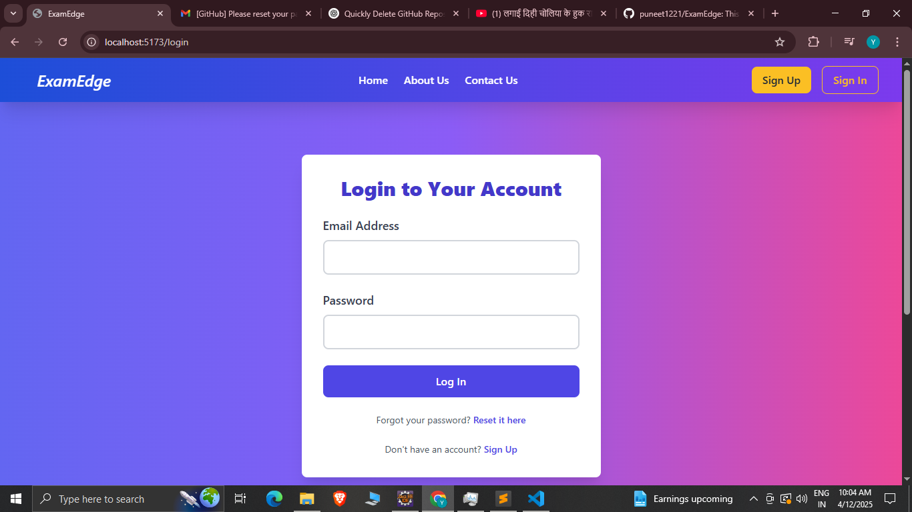
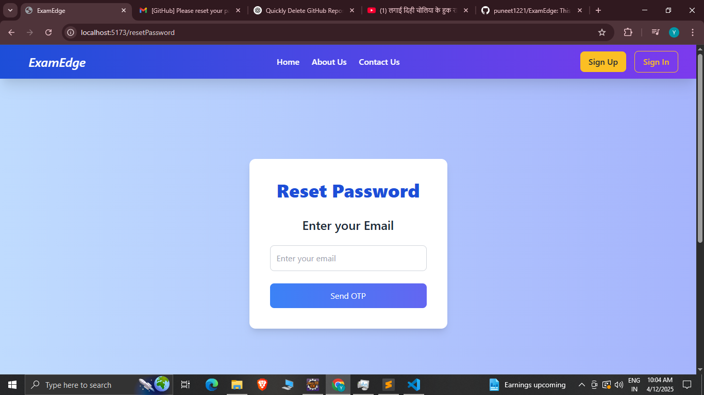
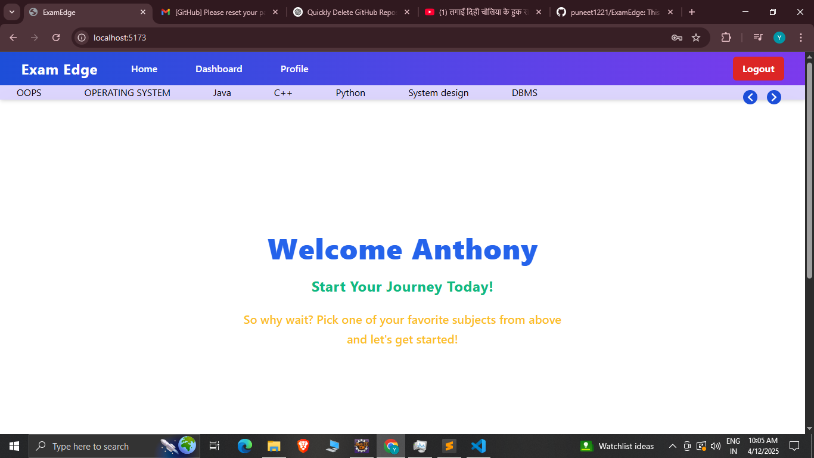
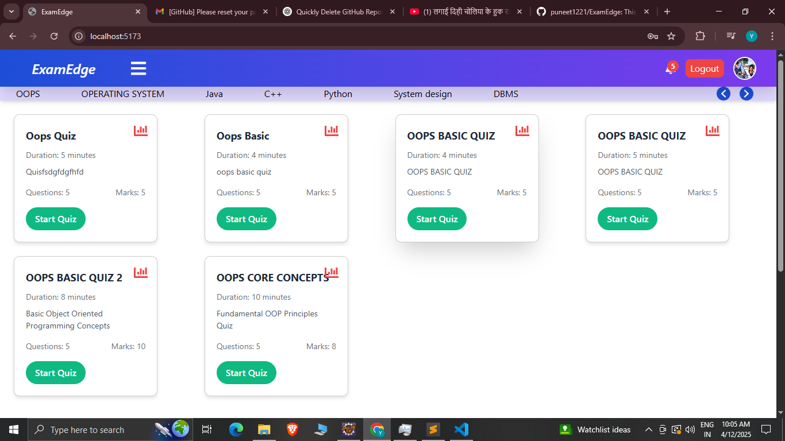
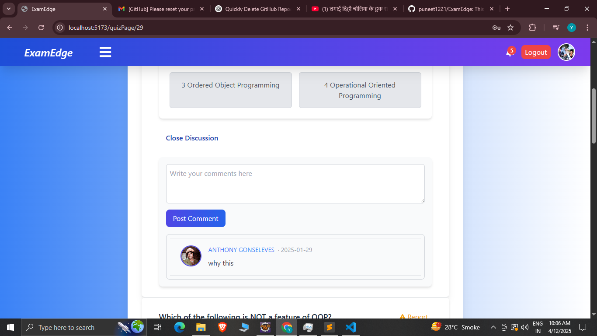
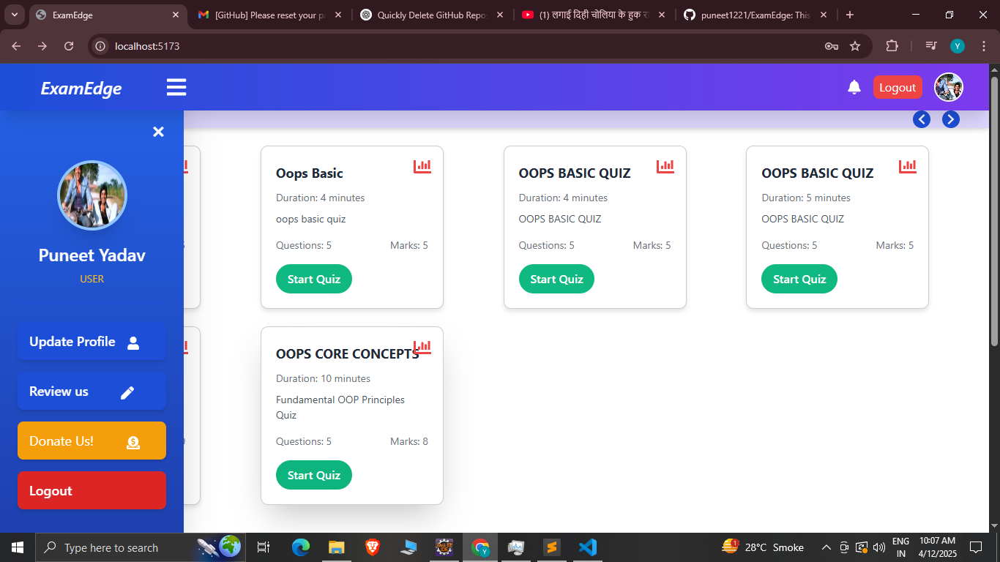
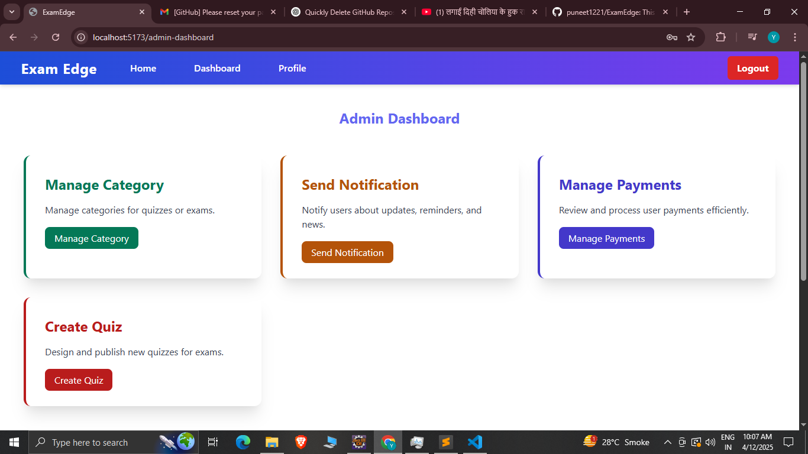
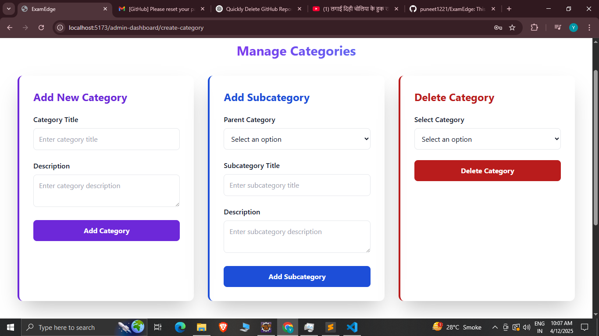
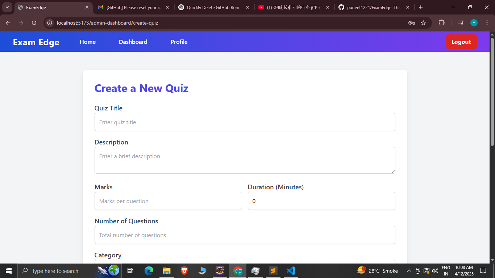
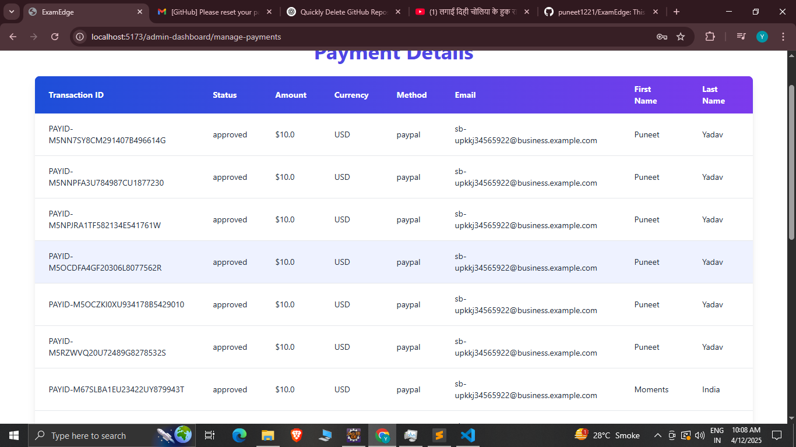

# ExamEdge

ExamEdge is a project designed using **React**, **Spring Boot**, and **MySQL**. It provides a comprehensive platform for dynamic quizzes, user management, and payment integration.

---

## Features

### User Side:
- **PayPal Payment Integration**
- **JWT Authentication**
- **Role-Based Authorization**
- **Dynamic Quizzes**
- **Leaderboard**
- **Discussion Section**
- **Profile Page**
- **Payment Page**
- **Sign-In & Forgot Password** with Mail-Based OTP

### Admin Side:
- **Manage Quizzes (CRUD Operations)**
- **Manage Payments**
- **Send Notifications**

---

## Screenshots

### Home Page











### Admin Side






---

## How to Run the Project

1. **Backend Setup**:
   - Install Java and Spring Boot.
   - Set up a MySQL database and configure the connection in the Spring Boot application.
   - Run the Spring Boot application.

2. **Frontend Setup**:
   - Install Node.js and npm.
   - Navigate to the React project directory and run:
     ```bash
     npm install
     npm start
     ```

3. **Access the Application**:
   - Open your browser and navigate to `http://localhost:3000` for the frontend.
   - The backend API will run on `http://localhost:8080`.

---

## Technologies Used

- **Frontend**: React.js
- **Backend**: Spring Boot
- **Database**: MySQL
- **Payment Gateway**: PayPal
- **Authentication**: JWT (JSON Web Token)

---

## Contribution Guidelines

1. Fork the repository.
2. Create a new branch for your feature or bug fix:
   ```bash
   git checkout -b feature-name
   ```
